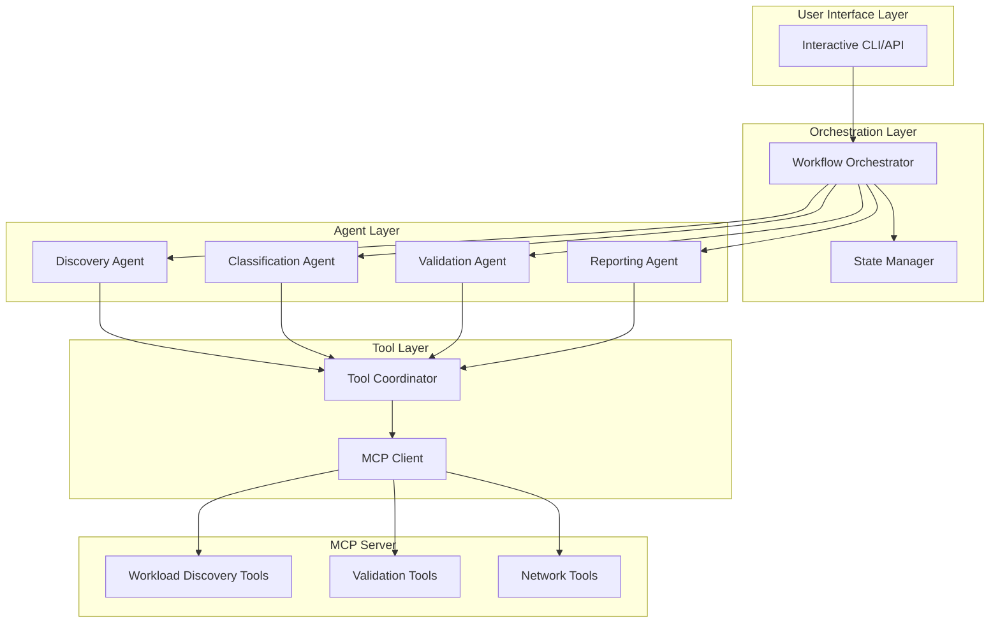

# Agentic Workflow Best Practices & MCP Integration Recommendations

## Executive Summary

This document provides a comprehensive analysis of the current agentic workflow in `python/src` and recommendations for converting it to industry best practices with enhanced MCP server integration for infrastructure and application validation.

**Current State**: Functional validation workflow with basic MCP integration
**Target State**: Production-ready agentic system following best practices with comprehensive MCP tool orchestration

---

## Table of Contents

1. [Current Architecture Analysis](#current-architecture-analysis)
2. [Identified Gaps & Opportunities](#identified-gaps--opportunities)
3. [Agentic Workflow Best Practices](#agentic-workflow-best-practices)
4. [Recommended Architecture](#recommended-architecture)
5. [MCP-Centric Design Patterns](#mcp-centric-design-patterns)
6. [Implementation Roadmap](#implementation-roadmap)
7. [Success Metrics](#success-metrics)

---

## Current Architecture Analysis

### Strengths ✅

1. **Well-Structured Components**
   - Clear separation of concerns (planner, executor, evaluator)
   - Pydantic models for type safety
   - MCP client abstraction layer

2. **Solid Foundation**
   - Credential management system
   - Interactive conversation handling
   - Report generation capabilities

3. **MCP Integration**
   - Official MCP SDK usage
   - SSE transport for real-time communication
   - Tool abstraction methods

### Weaknesses ⚠️

1. **Limited Agent Intelligence**
   - [`agent.py`](python/src/agent.py:52-122): Basic BeeAgent with minimal reasoning
   - No dynamic tool selection based on context
   - Hardcoded validation plans without adaptation

2. **Monolithic Orchestration**
   - [`recovery_validation_agent.py`](python/src/recovery_validation_agent.py:31-311): Single orchestrator handles everything
   - No specialized agents for different tasks
   - Limited parallel execution capabilities

3. **Tool Usage Patterns**
   - Sequential tool execution only
   - No tool chaining or composition
   - Missing error recovery strategies

4. **State Management**
   - Limited conversation state tracking
   - No persistent workflow state
   - Missing checkpoint/resume capabilities

---

## Identified Gaps & Opportunities

### Gap 1: Agent Reasoning & Planning

**Current**: Static validation plans based on resource type
**Opportunity**: Dynamic planning with LLM-powered reasoning

```python
# Current approach (planner.py)
def plan_vm_validation(self, resource_info: VMResourceInfo) -> ValidationPlan:
    # Hardcoded steps
    steps = [
        ValidationStep("vm_network_check", "tcp_portcheck", ...),
        ValidationStep("vm_uptime_load_mem", "vm_linux_uptime_load_mem", ...),
        # ...
    ]
```

**Recommended**: Agent-driven planning with context awareness

### Gap 2: Tool Orchestration

**Current**: Linear tool execution
**Opportunity**: Intelligent tool composition and parallel execution

### Gap 3: Multi-Agent Collaboration

**Current**: Single agent handles all tasks
**Opportunity**: Specialized agents working together

### Gap 4: Observability & Debugging

**Current**: Basic logging
**Opportunity**: Comprehensive tracing, metrics, and debugging tools

---

## Agentic Workflow Best Practices

### 1. Agent Design Principles

#### Principle 1: Single Responsibility
Each agent should have a clear, focused purpose.

```python
# ❌ Bad: Monolithic agent
class ValidationAgent:
    def discover(self): ...
    def classify(self): ...
    def validate(self): ...
    def report(self): ...

# ✅ Good: Specialized agents
class DiscoveryAgent:
    """Discovers workloads and applications"""
    
class ClassificationAgent:
    """Classifies resources based on discoveries"""
    
class ValidationAgent:
    """Executes validation checks"""
    
class ReportingAgent:
    """Generates reports and recommendations"""
```

#### Principle 2: Tool-First Design
Agents should leverage MCP tools as their primary capabilities.

```python
class MCPToolAgent:
    """Base agent that uses MCP tools"""
    
    def __init__(self, mcp_client: MCPClient):
        self.mcp_client = mcp_client
        self.available_tools = {}
    
    async def discover_tools(self):
        """Dynamically discover available MCP tools"""
        tools = await self.mcp_client.list_tools()
        self.available_tools = {t.name: t for t in tools}
    
    async def select_tool(self, task: str) -> str:
        """Use LLM to select appropriate tool for task"""
        # LLM reasoning to select best tool
        pass
    
    async def execute_tool(self, tool_name: str, args: dict):
        """Execute selected tool with error handling"""
        pass
```

#### Principle 3: Reasoning Before Action
Agents should explain their reasoning before taking actions.

```python
class ReasoningAgent:
    async def plan_and_execute(self, task: str):
        # Step 1: Understand the task
        understanding = await self.analyze_task(task)
        
        # Step 2: Generate plan with reasoning
        plan = await self.create_plan(understanding)
        self.log_reasoning(plan.reasoning)
        
        # Step 3: Execute with monitoring
        results = await self.execute_plan(plan)
        
        # Step 4: Reflect on results
        reflection = await self.reflect(results)
        
        return results, reflection
```

### 2. MCP Tool Orchestration Patterns

#### Pattern 1: Sequential Execution with Dependencies

```python
class SequentialOrchestrator:
    """Execute tools in sequence with dependency management"""
    
    async def execute_workflow(self, steps: List[WorkflowStep]):
        context = {}
        
        for step in steps:
            # Check dependencies
            if not self.dependencies_met(step, context):
                await self.resolve_dependencies(step, context)
            
            # Execute step
            result = await self.execute_step(step, context)
            
            # Update context for next steps
            context[step.output_key] = result
        
        return context
```

#### Pattern 2: Parallel Execution with Aggregation

```python
class ParallelOrchestrator:
    """Execute independent tools in parallel"""
    
    async def execute_parallel(self, tasks: List[Task]):
        # Group independent tasks
        task_groups = self.group_independent_tasks(tasks)
        
        results = []
        for group in task_groups:
            # Execute group in parallel
            group_results = await asyncio.gather(
                *[self.execute_task(task) for task in group],
                return_exceptions=True
            )
            results.extend(group_results)
        
        return self.aggregate_results(results)
```

#### Pattern 3: Conditional Execution with Branching

```python
class ConditionalOrchestrator:
    """Execute tools based on runtime conditions"""
    
    async def execute_conditional(self, workflow: ConditionalWorkflow):
        result = await self.execute_step(workflow.initial_step)
        
        # Evaluate condition
        condition_met = await self.evaluate_condition(
            workflow.condition, 
            result
        )
        
        # Branch based on condition
        if condition_met:
            return await self.execute_workflow(workflow.success_path)
        else:
            return await self.execute_workflow(workflow.failure_path)
```

### 3. Error Handling & Recovery

#### Strategy 1: Graceful Degradation

```python
class ResilientAgent:
    async def execute_with_fallback(self, primary_tool, fallback_tool, args):
        try:
            return await self.execute_tool(primary_tool, args)
        except ToolExecutionError as e:
            self.log_warning(f"Primary tool failed: {e}, trying fallback")
            return await self.execute_tool(fallback_tool, args)
        except Exception as e:
            self.log_error(f"All tools failed: {e}")
            return self.create_partial_result(e)
```

#### Strategy 2: Retry with Exponential Backoff

```python
class RetryStrategy:
    async def execute_with_retry(
        self, 
        tool_name: str, 
        args: dict,
        max_retries: int = 3,
        base_delay: float = 1.0
    ):
        for attempt in range(max_retries):
            try:
                return await self.execute_tool(tool_name, args)
            except TransientError as e:
                if attempt == max_retries - 1:
                    raise
                
                delay = base_delay * (2 ** attempt)
                await asyncio.sleep(delay)
                self.log_retry(attempt, delay)
```

### 4. State Management

#### Pattern: Workflow State Machine

```python
from enum import Enum
from dataclasses import dataclass

class WorkflowState(Enum):
    INITIALIZED = "initialized"
    DISCOVERING = "discovering"
    CLASSIFYING = "classifying"
    VALIDATING = "validating"
    REPORTING = "reporting"
    COMPLETED = "completed"
    FAILED = "failed"

@dataclass
class WorkflowContext:
    state: WorkflowState
    resource_info: dict
    discovery_results: Optional[dict] = None
    classification: Optional[dict] = None
    validation_results: Optional[dict] = None
    errors: List[str] = field(default_factory=list)
    
    def can_transition_to(self, new_state: WorkflowState) -> bool:
        """Check if state transition is valid"""
        valid_transitions = {
            WorkflowState.INITIALIZED: [WorkflowState.DISCOVERING],
            WorkflowState.DISCOVERING: [WorkflowState.CLASSIFYING, WorkflowState.FAILED],
            WorkflowState.CLASSIFYING: [WorkflowState.VALIDATING, WorkflowState.FAILED],
            WorkflowState.VALIDATING: [WorkflowState.REPORTING, WorkflowState.FAILED],
            WorkflowState.REPORTING: [WorkflowState.COMPLETED, WorkflowState.FAILED],
        }
        return new_state in valid_transitions.get(self.state, [])
```

---

## Recommended Architecture

### High-Level Architecture



### Component Breakdown

#### 1. Workflow Orchestrator (Enhanced)

```python
class WorkflowOrchestrator:
    """
    Main coordinator that manages the validation workflow
    using specialized agents and MCP tools.
    """
    
    def __init__(
        self,
        mcp_client: MCPClient,
        state_manager: StateManager,
        agents: Dict[str, BaseAgent]
    ):
        self.mcp_client = mcp_client
        self.state_manager = state_manager
        self.agents = agents
    
    async def execute_workflow(
        self, 
        request: ValidationRequest
    ) -> ValidationReport:
        """
        Execute complete validation workflow with state management
        """
        # Initialize workflow context
        context = WorkflowContext(
            state=WorkflowState.INITIALIZED,
            resource_info=request.resource_info.dict()
        )
        
        try:
            # Phase 1: Discovery
            context = await self.transition_to(
                context, 
                WorkflowState.DISCOVERING
            )
            discovery_results = await self.agents['discovery'].execute(
                context
            )
            context.discovery_results = discovery_results
            
            # Phase 2: Classification
            context = await self.transition_to(
                context,
                WorkflowState.CLASSIFYING
            )
            classification = await self.agents['classification'].execute(
                context
            )
            context.classification = classification
            
            # Phase 3: Validation
            context = await self.transition_to(
                context,
                WorkflowState.VALIDATING
            )
            validation_results = await self.agents['validation'].execute(
                context
            )
            context.validation_results = validation_results
            
            # Phase 4: Reporting
            context = await self.transition_to(
                context,
                WorkflowState.REPORTING
            )
            report = await self.agents['reporting'].execute(context)
            
            # Complete
            context = await self.transition_to(
                context,
                WorkflowState.COMPLETED
            )
            
            return report
            
        except Exception as e:
            context.errors.append(str(e))
            context = await self.transition_to(
                context,
                WorkflowState.FAILED
            )
            raise
    
    async def transition_to(
        self, 
        context: WorkflowContext, 
        new_state: WorkflowState
    ) -> WorkflowContext:
        """Transition workflow to new state with validation"""
        if not context.can_transition_to(new_state):
            raise InvalidStateTransition(
                f"Cannot transition from {context.state} to {new_state}"
            )
        
        context.state = new_state
        await self.state_manager.save_state(context)
        return context
```

#### 2. Specialized Agents

##### Discovery Agent

```python
class DiscoveryAgent(BaseAgent):
    """
    Discovers workloads and applications on infrastructure resources
    using MCP workload discovery tools.
    """
    
    async def execute(self, context: WorkflowContext) -> WorkloadDiscoveryResult:
        """
        Execute workload discovery workflow
        """
        resource_info = context.resource_info
        
        # Step 1: Scan ports
        self.log_step("Scanning ports...")
        port_results = await self.mcp_client.call_tool(
            "workload_scan_ports",
            {
                "host": resource_info['host'],
                "ssh_user": resource_info['ssh_user'],
                "ssh_password": resource_info.get('ssh_password'),
                "scan_type": "common"
            }
        )
        
        # Step 2: Scan processes
        self.log_step("Scanning processes...")
        process_results = await self.mcp_client.call_tool(
            "workload_scan_processes",
            {
                "host": resource_info['host'],
                "ssh_user": resource_info['ssh_user'],
                "ssh_password": resource_info.get('ssh_password')
            }
        )
        
        # Step 3: Detect applications
        self.log_step("Detecting applications...")
        app_detections = await self.mcp_client.call_tool(
            "workload_detect_applications",
            {
                "host": resource_info['host'],
                "ports": port_results.get('ports', []),
                "processes": process_results.get('processes', [])
            }
        )
        
        # Step 4: Aggregate results
        self.log_step("Aggregating discovery results...")
        aggregated = await self.mcp_client.call_tool(
            "workload_aggregate_results",
            {
                "host": resource_info['host'],
                "port_results": port_results,
                "process_results": process_results,
                "app_detections": app_detections
            }
        )
        
        return WorkloadDiscoveryResult(**aggregated)
```

##### Classification Agent

```python
class ClassificationAgent(BaseAgent):
    """
    Classifies resources based on discovered applications
    and recommends validation strategies.
    """
    
    def __init__(self, mcp_client: MCPClient, classifier: ApplicationClassifier):
        super().__init__(mcp_client)
        self.classifier = classifier
    
    async def execute(self, context: WorkflowContext) -> ResourceClassification:
        """
        Classify resource and recommend validation strategy
        """
        discovery_results = context.discovery_results
        
        # Classify based on discovered applications
        classification = self.classifier.classify(discovery_results)
        
        # Log classification results
        self.log_classification(classification)
        
        return classification
```

##### Validation Agent

```python
class ValidationAgent(BaseAgent):
    """
    Executes validation checks based on resource classification
    using appropriate MCP tools.
    """
    
    def __init__(
        self, 
        mcp_client: MCPClient,
        planner: ValidationPlanner,
        executor: ValidationExecutor
    ):
        super().__init__(mcp_client)
        self.planner = planner
        self.executor = executor
    
    async def execute(self, context: WorkflowContext) -> ValidationResults:
        """
        Execute validation workflow
        """
        classification = context.classification
        resource_info = context.resource_info
        
        # Generate validation plan based on classification
        plan = self.planner.generate_plan_from_classification(
            classification,
            resource_info
        )
        
        self.log_plan(plan)
        
        # Execute validation plan
        results = await self.executor.execute_plan(plan)
        
        return results
```

##### Reporting Agent

```python
class ReportingAgent(BaseAgent):
    """
    Generates comprehensive reports with recommendations
    based on validation results.
    """
    
    async def execute(self, context: WorkflowContext) -> ValidationReport:
        """
        Generate validation report
        """
        # Evaluate results against acceptance criteria
        evaluation = self.evaluator.evaluate(
            context.classification,
            context.validation_results
        )
        
        # Generate recommendations
        recommendations = self.generate_recommendations(
            context.classification,
            evaluation
        )
        
        # Create report
        report = ValidationReport(
            resource_info=context.resource_info,
            discovery=context.discovery_results,
            classification=context.classification,
            validation_results=evaluation,
            recommendations=recommendations
        )
        
        return report
```

#### 3. Tool Coordinator

```python
class ToolCoordinator:
    """
    Coordinates MCP tool execution with intelligent selection,
    error handling, and result caching.
    """
    
    def __init__(self, mcp_client: MCPClient):
        self.mcp_client = mcp_client
        self.tool_cache = {}
        self.execution_history = []
    
    async def execute_tool(
        self,
        tool_name: str,
        arguments: dict,
        retry_policy: Optional[RetryPolicy] = None
    ) -> dict:
        """
        Execute MCP tool with caching and retry logic
        """
        # Check cache
        cache_key = self._get_cache_key(tool_name, arguments)
        if cache_key in self.tool_cache:
            return self.tool_cache[cache_key]
        
        # Execute with retry
        retry_policy = retry_policy or RetryPolicy.default()
        result = await self._execute_with_retry(
            tool_name,
            arguments,
            retry_policy
        )
        
        # Cache result
        self.tool_cache[cache_key] = result
        
        # Record execution
        self.execution_history.append({
            "tool": tool_name,
            "arguments": arguments,
            "result": result,
            "timestamp": datetime.now()
        })
        
        return result
    
    async def execute_parallel(
        self,
        tool_calls: List[Tuple[str, dict]]
    ) -> List[dict]:
        """
        Execute multiple tools in parallel
        """
        tasks = [
            self.execute_tool(tool_name, args)
            for tool_name, args in tool_calls
        ]
        
        results = await asyncio.gather(*tasks, return_exceptions=True)
        
        return results
```

---

## MCP-Centric Design Patterns

### Pattern 1: Tool Discovery & Selection

```python
class DynamicToolSelector:
    """
    Dynamically discover and select appropriate MCP tools
    based on task requirements.
    """
    
    async def select_tools_for_task(
        self,
        task_description: str,
        available_tools: List[MCPTool]
    ) -> List[MCPTool]:
        """
        Use LLM reasoning to select appropriate tools
        """
        # Create tool descriptions
        tool_descriptions = [
            f"{tool.name}: {tool.description}"
            for tool in available_tools
        ]
        
        # Use LLM to select tools
        prompt = f"""
        Task: {task_description}
        
        Available tools:
        {chr(10).join(tool_descriptions)}
        
        Select the most appropriate tools to accomplish this task.
        Return a JSON list of tool names.
        """
        
        selected_names = await self.llm.generate(prompt)
        
        # Return selected tools
        return [
            tool for tool in available_tools
            if tool.name in selected_names
        ]
```

### Pattern 2: Tool Composition

```python
class ToolComposer:
    """
    Compose multiple MCP tools into higher-level operations
    """
    
    async def compose_discovery_workflow(
        self,
        host: str,
        credentials: dict
    ) -> WorkloadDiscoveryResult:
        """
        Compose workload discovery from multiple tools
        """
        # Define tool pipeline
        pipeline = [
            ("workload_scan_ports", {"host": host, **credentials}),
            ("workload_scan_processes", {"host": host, **credentials}),
            ("workload_detect_applications", {
                "host": host,
                "ports": "${workload_scan_ports.ports}",
                "processes": "${workload_scan_processes.processes}"
            }),
            ("workload_aggregate_results", {
                "host": host,
                "port_results": "${workload_scan_ports}",
                "process_results": "${workload_scan_processes}",
                "app_detections": "${workload_detect_applications}"
            })
        ]
        
        # Execute pipeline with dependency resolution
        return await self.execute_pipeline(pipeline)
```

### Pattern 3: Tool Result Validation

```python
class ToolResultValidator:
    """
    Validate MCP tool results before using them
    """
    
    def validate_result(
        self,
        tool_name: str,
        result: dict,
        schema: dict
    ) -> ValidationResult:
        """
        Validate tool result against expected schema
        """
        # Check if result has 'ok' status
        if not result.get('ok', False):
            return ValidationResult(
                valid=False,
                errors=[result.get('error', 'Unknown error')]
            )
        
        # Validate against schema
        try:
            validate(instance=result, schema=schema)
            return ValidationResult(valid=True)
        except ValidationError as e:
            return ValidationResult(
                valid=False,
                errors=[str(e)]
            )
```

---

## Implementation Roadmap

### Phase 1: Foundation (Weeks 1-2)

#### Week 1: Architecture Setup
- [ ] Create base agent classes
- [ ] Implement state management system
- [ ] Set up tool coordinator
- [ ] Add comprehensive logging

#### Week 2: Agent Implementation
- [ ] Implement Discovery Agent
- [ ] Implement Classification Agent
- [ ] Implement Validation Agent
- [ ] Implement Reporting Agent

**Deliverables**:
- Base agent framework
- State management system
- Four specialized agents

### Phase 2: Tool Orchestration (Weeks 3-4)

#### Week 3: Tool Patterns
- [ ] Implement sequential orchestration
- [ ] Implement parallel orchestration
- [ ] Implement conditional orchestration
- [ ] Add tool composition

#### Week 4: Error Handling
- [ ] Implement retry strategies
- [ ] Add graceful degradation
- [ ] Create fallback mechanisms
- [ ] Add circuit breakers

**Deliverables**:
- Tool orchestration patterns
- Robust error handling
- Comprehensive testing

### Phase 3: Integration & Testing (Weeks 5-6)

#### Week 5: Integration
- [ ] Integrate all agents with orchestrator
- [ ] Connect to MCP server
- [ ] Add observability
- [ ] Performance optimization

#### Week 6: Testing & Documentation
- [ ] Unit tests for all components
- [ ] Integration tests
- [ ] End-to-end tests
- [ ] Documentation

**Deliverables**:
- Fully integrated system
- Test coverage >80%
- Complete documentation

### Phase 4: Advanced Features (Weeks 7-8)

#### Week 7: Advanced Capabilities
- [ ] Add LLM-powered reasoning
- [ ] Implement dynamic planning
- [ ] Add learning from feedback
- [ ] Multi-resource validation

#### Week 8: Production Readiness
- [ ] Performance tuning
- [ ] Security hardening
- [ ] Monitoring & alerting
- [ ] Deployment automation

**Deliverables**:
- Production-ready system
- Monitoring dashboards
- Deployment guides

---

## Success Metrics

### Functional Metrics

1. **Discovery Accuracy**: >90% application detection accuracy
2. **Validation Coverage**: 100% of discovered applications validated
3. **Error Recovery**: <5% unrecoverable errors
4. **Performance**: <2 minutes per resource validation

### Quality Metrics

1. **Code Coverage**: >80% test coverage
2. **Documentation**: 100% public API documented
3. **Type Safety**: 100% type hints
4. **Logging**: Comprehensive structured logging

### Operational Metrics

1. **Reliability**: 99.9% uptime
2. **Scalability**: Support 100+ concurrent validations
3. **Observability**: Full tracing and metrics
4. **Maintainability**: <2 hours to add new validation type

---

## Key Recommendations Summary

### 1. Adopt Multi-Agent Architecture
Replace monolithic orchestrator with specialized agents for discovery, classification, validation, and reporting.

### 2. Implement Tool-First Design
Make MCP tools the primary capability layer, with agents orchestrating tool usage.

### 3. Add Intelligent Orchestration
Implement sequential, parallel, and conditional tool execution patterns.

### 4. Enhance State Management
Add workflow state machine with checkpoint/resume capabilities.

### 5. Improve Error Handling
Implement retry strategies, graceful degradation, and fallback mechanisms.

### 6. Add Observability
Comprehensive logging, tracing, and metrics for debugging and monitoring.

### 7. Enable Dynamic Planning
Use LLM reasoning for adaptive validation plan generation.

### 8. Support Parallel Execution
Execute independent validation checks in parallel for performance.

---

## Conclusion

The current agentic workflow provides a solid foundation but can be significantly enhanced by adopting industry best practices:

1. **Multi-agent architecture** for better separation of concerns
2. **MCP-centric design** leveraging tools as primary capabilities
3. **Intelligent orchestration** with parallel and conditional execution
4. **Robust error handling** with retry and fallback strategies
5. **Comprehensive observability** for debugging and monitoring

By following this roadmap, the validation workflow will become more maintainable, scalable, and production-ready while fully leveraging the power of MCP servers for infrastructure and application validation.

---

**Next Steps**:
1. Review and approve this plan
2. Prioritize implementation phases
3. Begin Phase 1 implementation
4. Iterate based on feedback
