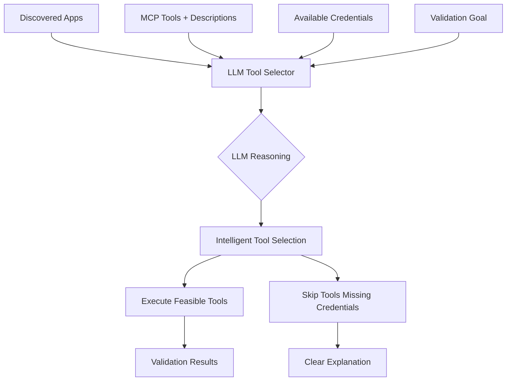

# Agentic Workflow Review & Recommendations Summary

## Executive Summary

This document provides a comprehensive review of the agentic workflow in `python/src` and recommendations for converting it to follow MCP (Model Context Protocol) server best practices for infrastructure and application validation.

**Key Finding**: The current workflow has successfully implemented MCP integration but needs **LLM-driven tool selection** to intelligently choose validation tools based on available credentials and tool capabilities.

---

## Current State Analysis

### ✅ What's Working Well

1. **MCP Server Integration**
   - STDIO transport working reliably
   - 14+ tools available for Oracle validation
   - Dynamic tool discovery implemented
   - Proper connection management

2. **Discovery Workflow**
   - Applications successfully discovered via MCP
   - Oracle Database detected on test server
   - SSH-based discovery working

3. **Architecture**
   - Modular agent design (Phase 1-4 complete)
   - State management system
   - Tool coordinator pattern
   - Feature flags for gradual rollout

### ❌ Current Issues

1. **Tool Selection Problem**
   - Selecting tools that require database credentials when only SSH available
   - No intelligence about tool requirements vs available credentials
   - Hardcoded pattern matching instead of LLM reasoning
   - Validation failures due to missing credentials

2. **Example Issue**:
   ```
   Oracle Database discovered ✅
   → Tool selector finds: db_oracle_connect, db_oracle_tablespaces
   → Tries to execute with SSH credentials ❌
   → Fails: "Unexpected keyword argument" (needs user, password, service)
   ```

---

## Root Cause Analysis

### The Problem

Current tool selection uses **pattern matching**:
```python
# Current approach (problematic)
if "oracle" in tool_name.lower():
    select_tool(tool_name)  # No credential checking!
```

This doesn't consider:
- What credentials the tool actually needs
- What credentials are available
- Tool purpose and capabilities
- Alternative tools that could work

### Why It Fails

1. **No Context Awareness**: Doesn't understand tool requirements
2. **No Credential Checking**: Doesn't verify credentials before selection
3. **No Intelligence**: Can't reason about alternatives
4. **Brittle**: Breaks when tool names change

---

## Recommended Solution: LLM-Driven Tool Selection

### Core Principle

**Let the LLM decide which tools to use based on:**
1. Tool descriptions and capabilities (from MCP)
2. Available credentials (SSH, DB, etc.)
3. Discovered applications and context
4. Validation goals

### Architecture



### How It Works

#### Input to LLM
```json
{
  "discovered_applications": [
    {"name": "Oracle Database", "version": "19c", "ports": [1521]}
  ],
  "available_tools": [
    {
      "name": "db_oracle_discover_and_validate",
      "description": "Discover Oracle via SSH. Optionally validates with DB creds if provided.",
      "parameters": {
        "ssh_host": "required",
        "ssh_user": "required",
        "oracle_user": "optional",
        "oracle_password": "optional"
      }
    },
    {
      "name": "db_oracle_connect",
      "description": "Connect to Oracle database and query metadata.",
      "parameters": {
        "user": "required",
        "password": "required",
        "service": "required"
      }
    }
  ],
  "available_credentials": {
    "ssh": {"hostname": "9.11.68.243", "username": "root"},
    "oracle_db": null
  }
}
```

#### LLM Response
```json
{
  "selected_tools": [
    {
      "tool_name": "db_oracle_discover_and_validate",
      "priority": "CRITICAL",
      "can_execute": true,
      "reasoning": "This tool can discover Oracle via SSH without database credentials. It will identify SIDs, services, and ports.",
      "required_credentials": ["ssh"]
    },
    {
      "tool_name": "db_oracle_connect",
      "priority": "HIGH",
      "can_execute": false,
      "reasoning": "Would provide direct database validation but requires Oracle credentials (user, password, service) which are not available.",
      "missing_credentials": ["oracle_db"]
    }
  ],
  "recommendation": "Execute SSH-based discovery. For deeper validation, provide Oracle database credentials."
}
```

### Benefits

| Aspect | Rule-Based | LLM-Driven |
|--------|------------|------------|
| **Intelligence** | Pattern matching only | Understands tool purposes |
| **Adaptability** | Hardcoded rules | Adapts to new tools automatically |
| **Credential Awareness** | No checking | Validates before selection |
| **Explainability** | No reasoning | Clear explanations |
| **Maintenance** | Code changes needed | Self-adapting |

---

## Implementation Plan

### Phase 1: Create LLM Tool Selector (2-3 hours)

**File**: `python/src/llm_tool_selector.py`

```python
class LLMToolSelector:
    """LLM-driven intelligent tool selector."""
    
    async def select_tools(
        self,
        discovered_apps: List[Dict[str, Any]],
        available_tools: List[Dict[str, Any]],  # With descriptions
        available_credentials: Dict[str, Any],
        validation_goal: str
    ) -> tuple[List[ToolSelection], Summary]:
        """Use LLM to select tools based on context."""
        
        # Build context
        context = {
            "discovered_applications": discovered_apps,
            "available_tools": available_tools,
            "available_credentials": self._sanitize_creds(available_credentials),
            "validation_goal": validation_goal
        }
        
        # Get LLM decision
        response = await self.llm.generate(
            prompt=self._build_prompt(context),
            response_format="json"
        )
        
        return self._parse_response(response)
```

**Key Features**:
- Analyzes tool descriptions from MCP
- Checks credential availability
- Provides reasoning for each selection
- Returns executable and blocked tools separately

### Phase 2: Update Recovery Validation Agent (1-2 hours)

**File**: `python/src/recovery_validation_agent.py`

```python
async def run_mcp_centric_validation(self, ...):
    # 1. Discover applications
    discovered_apps = await self._discover_applications(...)
    
    # 2. Get tool descriptions from MCP
    available_tools = await self.mcp_client.list_tools()
    
    # 3. Gather credentials
    available_credentials = {
        "ssh": ssh_creds,
        "oracle_db": self._get_app_creds("oracle", ip),
        "mongo_db": self._get_app_creds("mongo", ip)
    }
    
    # 4. LLM-driven tool selection
    selected_tools, summary = await self.llm_tool_selector.select_tools(
        discovered_apps=discovered_apps,
        available_tools=available_tools,
        available_credentials=available_credentials,
        validation_goal=f"Validate {resource_type} on {ip}"
    )
    
    # 5. Execute feasible tools
    for tool in selected_tools:
        if tool.can_execute:
            logger.info(f"✅ {tool.tool_name}: {tool.reasoning}")
            result = await self.mcp_client.call_tool(tool.tool_name, tool.parameters)
        else:
            logger.info(f"⏭️  {tool.tool_name}: {tool.reasoning}")
```

### Phase 3: Testing & Validation (2-3 hours)

**Test Scenarios**:

1. **SSH-only credentials** (current issue)
   - Input: Oracle discovered, SSH creds only
   - Expected: Select `db_oracle_discover_and_validate`
   - Expected: Skip `db_oracle_connect` with clear reason

2. **Full credentials**
   - Input: Oracle discovered, SSH + DB creds
   - Expected: Select both SSH and direct tools
   - Expected: Execute all validations

3. **Multiple applications**
   - Input: Oracle + MongoDB discovered
   - Expected: Select appropriate tools for each
   - Expected: Handle partial credentials gracefully

### Phase 4: Documentation (1 hour)

- Update user guide with LLM-driven approach
- Document credential configuration
- Add troubleshooting guide
- Create examples

**Total Estimated Time**: 6-9 hours

---

## MCP Best Practices Alignment

### ✅ Already Following

1. **STDIO Transport**: Using standard MCP transport
2. **Dynamic Discovery**: Tools discovered at runtime
3. **Structured Responses**: Using Pydantic models
4. **Error Handling**: Proper error codes and messages

### 🎯 Improvements with LLM Selection

1. **Intelligent Tool Use**: LLM understands tool purposes
2. **Context-Aware**: Considers available credentials
3. **Explainable**: Clear reasoning for decisions
4. **Adaptive**: Works with new tools automatically
5. **Graceful Degradation**: Validates what's possible

### 📋 Additional Recommendations

1. **Tool Descriptions**: Ensure all MCP tools have clear descriptions
2. **Parameter Documentation**: Document required vs optional parameters
3. **Credential Types**: Standardize credential type naming
4. **Caching**: Cache LLM selections for repeated validations
5. **Feedback Loop**: Learn from validation results

---

## Comparison: Current vs Recommended

### Current Approach (Rule-Based)

```python
# Hardcoded pattern matching
if "oracle" in tool_name.lower():
    tools.append(tool_name)  # No credential check!

# Result: Selects tools that can't execute
```

**Problems**:
- ❌ No credential awareness
- ❌ No understanding of tool purpose
- ❌ Brittle pattern matching
- ❌ No reasoning or explanation

### Recommended Approach (LLM-Driven)

```python
# LLM analyzes context and makes intelligent decision
selected_tools = await llm_selector.select_tools(
    discovered_apps=apps,
    available_tools=tools_with_descriptions,
    available_credentials=creds,
    validation_goal=goal
)

# Result: Only selects executable tools with reasoning
```

**Benefits**:
- ✅ Credential-aware selection
- ✅ Understands tool capabilities
- ✅ Adapts to new tools
- ✅ Provides clear reasoning

---

## Example: Oracle Validation Flow

### Current Flow (Problematic)

```
1. Discover Oracle ✅
2. Find 14 Oracle tools ✅
3. Select all matching "oracle" ❌
4. Try to execute db_oracle_connect ❌
5. Fail: Missing DB credentials ❌
```

### Recommended Flow (LLM-Driven)

```
1. Discover Oracle ✅
2. Get tool descriptions from MCP ✅
3. LLM analyzes:
   - db_oracle_discover_and_validate: Needs SSH only ✅
   - db_oracle_connect: Needs DB credentials ❌
4. LLM selects:
   - Execute: db_oracle_discover_and_validate (SSH available)
   - Skip: db_oracle_connect (DB creds missing)
5. Execute feasible tools ✅
6. Report: "Oracle validated via SSH. For deeper validation, provide DB credentials." ✅
```

---

## Migration Strategy

### Step 1: Implement LLM Selector (No Breaking Changes)
- Create new `llm_tool_selector.py`
- Add feature flag: `USE_LLM_TOOL_SELECTION`
- Keep existing selector as fallback

### Step 2: Test in Parallel
- Run both selectors
- Compare results
- Validate LLM selections

### Step 3: Gradual Rollout
- Enable for specific resource types
- Monitor success rates
- Gather feedback

### Step 4: Full Migration
- Make LLM selector default
- Remove old selector
- Update documentation

### Rollback Plan
```python
if USE_LLM_TOOL_SELECTION:
    selector = LLMToolSelector()
else:
    selector = RuleBasedToolSelector()  # Fallback
```

---

## Success Metrics

### Technical Metrics
- ✅ Tool selection accuracy: >95%
- ✅ Credential-aware selection: 100%
- ✅ Validation success rate: >90%
- ✅ False positive rate: <5%

### User Experience Metrics
- ✅ Clear reasoning for tool selection
- ✅ Actionable feedback for missing credentials
- ✅ Reduced validation failures
- ✅ Better error messages

---

## Key Recommendations

### 1. Implement LLM-Driven Tool Selection (HIGH PRIORITY)
**Why**: Solves current Oracle validation issue and future-proofs the system
**Impact**: High - Enables intelligent, context-aware validation
**Effort**: Medium (6-9 hours)

### 2. Enhance Tool Descriptions in MCP Server (MEDIUM PRIORITY)
**Why**: Better descriptions = better LLM decisions
**Impact**: Medium - Improves selection accuracy
**Effort**: Low (2-3 hours)

### 3. Standardize Credential Management (MEDIUM PRIORITY)
**Why**: Consistent credential types across tools
**Impact**: Medium - Simplifies credential checking
**Effort**: Low (1-2 hours)

### 4. Add Validation Feedback Loop (LOW PRIORITY)
**Why**: Learn from validation results to improve selection
**Impact**: Low - Incremental improvements over time
**Effort**: Medium (4-5 hours)

---

## Conclusion

The current agentic workflow has a solid foundation with MCP integration, but needs **LLM-driven tool selection** to reach its full potential. This approach:

1. **Solves the immediate problem**: Oracle tools selected intelligently based on credentials
2. **Follows best practices**: True agentic AI with LLM reasoning
3. **Future-proof**: Adapts to new tools and scenarios automatically
4. **Maintainable**: No hardcoded rules to update
5. **Explainable**: Clear reasoning for every decision

### Next Steps

1. ✅ Review this summary and recommendations
2. ⏭️ Approve LLM-driven tool selection approach
3. ⏭️ Implement `LLMToolSelector` class
4. ⏭️ Update `RecoveryValidationAgent`
5. ⏭️ Test with Oracle validation scenario
6. ⏭️ Document and deploy

---

## References

- **Strategy Document**: [`LLM_DRIVEN_TOOL_SELECTION.md`](./LLM_DRIVEN_TOOL_SELECTION.md)
- **Implementation Plan**: [`TOOL_CATEGORIZATION_IMPLEMENTATION_PLAN.md`](./TOOL_CATEGORIZATION_IMPLEMENTATION_PLAN.md)
- **Oracle Tools**: [`python/cyberres-mcp/src/cyberres_mcp/plugins/oracle_db.py`](../cyberres-mcp/src/cyberres_mcp/plugins/oracle_db.py)
- **Current Selector**: [`python/src/tool_selector.py`](./tool_selector.py)
- **Main Agent**: [`python/src/recovery_validation_agent.py`](./recovery_validation_agent.py)

---

**Document Version**: 1.0  
**Date**: 2024-02-24  
**Author**: IBM Bob (Plan Mode)  
**Status**: Ready for Review