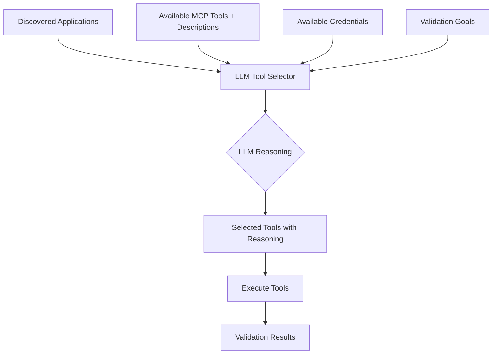

# LLM-Driven Tool Selection Strategy

## Core Principle

**Tool selection should be intelligent and context-aware, driven by an LLM that understands:**
1. What each tool can do (tool capabilities/descriptions)
2. What information is available (credentials, discovered data)
3. What the validation goal is (discover, validate, deep-check)

## Why LLM-Driven Selection?

### Problems with Rule-Based Selection ❌
- Hardcoded patterns break when tool names change
- Cannot adapt to new tools without code changes
- No understanding of tool purpose or requirements
- Cannot reason about credential availability
- Brittle and maintenance-heavy

### Benefits of LLM-Driven Selection ✅
- **Intelligent**: Understands tool descriptions and capabilities
- **Adaptive**: Works with new tools automatically
- **Context-aware**: Considers available credentials and data
- **Explainable**: Provides reasoning for tool selection
- **Extensible**: No code changes needed for new tools

## Architecture



## LLM-Driven Selection Flow

### Input to LLM

```python
context = {
    "discovered_applications": [
        {
            "name": "Oracle Database",
            "version": "19c",
            "ports": [1521],
            "confidence": "high"
        }
    ],
    "available_tools": [
        {
            "name": "db_oracle_discover_and_validate",
            "description": "Discover Oracle listener/services via SSH and optionally validate DB connectivity. Uses ps -ef | grep pmon to infer SIDs, runs lsnrctl status to parse services. If oracle_user and oracle_password provided, attempts connection.",
            "parameters": {
                "ssh_host": "required",
                "ssh_user": "required", 
                "ssh_password": "optional",
                "ssh_key_path": "optional",
                "oracle_user": "optional",
                "oracle_password": "optional"
            }
        },
        {
            "name": "db_oracle_connect",
            "description": "Attempt to connect to an Oracle instance and return basic info. Requires either DSN or host+service. Queries v$instance and v$database for metadata.",
            "parameters": {
                "dsn": "optional",
                "host": "optional",
                "port": "optional (default: 1521)",
                "service": "optional",
                "user": "required",
                "password": "required"
            }
        },
        {
            "name": "vm_validate_core",
            "description": "Validate VM core functionality via SSH including connectivity, disk space, memory, CPU.",
            "parameters": {
                "host": "required",
                "ssh_user": "required",
                "ssh_password": "optional",
                "ssh_key_path": "optional"
            }
        }
    ],
    "available_credentials": {
        "ssh": {
            "hostname": "9.11.68.243",
            "username": "root",
            "password": "available"
        },
        "oracle_db": None  # No Oracle DB credentials
    },
    "validation_goal": "Validate Oracle Database recovery on server 9.11.68.243"
}
```

### LLM Prompt

```
You are an intelligent tool selector for infrastructure validation. Your task is to select the most appropriate validation tools based on:

1. Discovered applications and their details
2. Available MCP tools and their capabilities
3. Available credentials
4. Validation goals

For each tool you select, provide:
- Tool name
- Priority (CRITICAL, HIGH, MEDIUM, LOW)
- Reasoning (why this tool is appropriate)
- Can execute (true/false based on credential availability)

Context:
{context}

Instructions:
- Prioritize tools that can execute with available credentials
- Select SSH-based discovery tools when database credentials are unavailable
- Explain why certain tools cannot be executed
- Order tools by priority and execution feasibility

Output format (JSON):
{
  "selected_tools": [
    {
      "tool_name": "db_oracle_discover_and_validate",
      "priority": "CRITICAL",
      "can_execute": true,
      "reasoning": "This tool can discover Oracle via SSH without requiring database credentials. It will identify SIDs, services, and ports, providing valuable validation data.",
      "required_credentials": ["ssh"]
    },
    {
      "tool_name": "db_oracle_connect",
      "priority": "HIGH",
      "can_execute": false,
      "reasoning": "This tool requires Oracle database credentials (user, password, service) which are not available. It would provide direct database validation but cannot be executed.",
      "required_credentials": ["ssh", "oracle_db"],
      "missing_credentials": ["oracle_db"]
    }
  ],
  "summary": {
    "total_tools_available": 3,
    "tools_can_execute": 2,
    "tools_blocked_by_credentials": 1,
    "recommendation": "Proceed with SSH-based validation. Oracle discovery will provide service details that could be used for future direct validation if credentials become available."
  }
}
```

### Expected LLM Response

```json
{
  "selected_tools": [
    {
      "tool_name": "db_oracle_discover_and_validate",
      "priority": "CRITICAL",
      "can_execute": true,
      "reasoning": "This SSH-based tool can discover Oracle instances without database credentials. It will identify SIDs, services, ports, and listener status - providing comprehensive validation of Oracle availability.",
      "required_credentials": ["ssh"],
      "parameters": {
        "ssh_host": "9.11.68.243",
        "ssh_user": "root",
        "ssh_password": "<from_credentials>"
      }
    },
    {
      "tool_name": "vm_validate_core",
      "priority": "HIGH",
      "can_execute": true,
      "reasoning": "Essential infrastructure validation to ensure the VM is accessible and has adequate resources (disk, memory, CPU) to run Oracle Database.",
      "required_credentials": ["ssh"],
      "parameters": {
        "host": "9.11.68.243",
        "ssh_user": "root",
        "ssh_password": "<from_credentials>"
      }
    },
    {
      "tool_name": "db_oracle_connect",
      "priority": "MEDIUM",
      "can_execute": false,
      "reasoning": "Would provide direct database validation by connecting to Oracle and querying v$instance and v$database. However, requires Oracle database credentials (user, password, service) which are not currently available.",
      "required_credentials": ["ssh", "oracle_db"],
      "missing_credentials": ["oracle_db"]
    }
  ],
  "summary": {
    "total_tools_available": 3,
    "tools_can_execute": 2,
    "tools_blocked_by_credentials": 1,
    "recommendation": "Execute SSH-based validation tools (db_oracle_discover_and_validate, vm_validate_core). These will validate Oracle availability and VM health without requiring database credentials. If database-level validation is needed, Oracle credentials should be provided."
  }
}
```

## Implementation

### 1. Create LLM Tool Selector

```python
# python/src/llm_tool_selector.py

from typing import List, Dict, Any, Optional
import json
from pydantic import BaseModel
from llm import get_llm_client

class ToolSelectionResult(BaseModel):
    """Result from LLM tool selection."""
    tool_name: str
    priority: str
    can_execute: bool
    reasoning: str
    required_credentials: List[str]
    missing_credentials: Optional[List[str]] = None
    parameters: Optional[Dict[str, Any]] = None

class ToolSelectionSummary(BaseModel):
    """Summary of tool selection."""
    total_tools_available: int
    tools_can_execute: int
    tools_blocked_by_credentials: int
    recommendation: str

class LLMToolSelector:
    """LLM-driven intelligent tool selector."""
    
    def __init__(self):
        self.llm = get_llm_client()
    
    async def select_tools(
        self,
        discovered_apps: List[Dict[str, Any]],
        available_tools: List[Dict[str, Any]],  # Tool name + description + parameters
        available_credentials: Dict[str, Any],
        validation_goal: str
    ) -> tuple[List[ToolSelectionResult], ToolSelectionSummary]:
        """Use LLM to intelligently select tools based on context.
        
        Args:
            discovered_apps: Applications discovered on the target
            available_tools: MCP tools with descriptions and parameter info
            available_credentials: Available credentials by type
            validation_goal: What we're trying to validate
        
        Returns:
            Tuple of (selected tools, summary)
        """
        
        # Build context for LLM
        context = {
            "discovered_applications": discovered_apps,
            "available_tools": available_tools,
            "available_credentials": self._sanitize_credentials(available_credentials),
            "validation_goal": validation_goal
        }
        
        # Create prompt
        prompt = self._build_selection_prompt(context)
        
        # Get LLM response
        response = await self.llm.generate(
            prompt=prompt,
            response_format="json",
            temperature=0.1  # Low temperature for consistent selection
        )
        
        # Parse response
        result = json.loads(response)
        
        # Convert to Pydantic models
        selected_tools = [
            ToolSelectionResult(**tool)
            for tool in result["selected_tools"]
        ]
        
        summary = ToolSelectionSummary(**result["summary"])
        
        return selected_tools, summary
    
    def _sanitize_credentials(self, creds: Dict[str, Any]) -> Dict[str, Any]:
        """Remove sensitive data from credentials for LLM context."""
        sanitized = {}
        for cred_type, cred_data in creds.items():
            if cred_data is None:
                sanitized[cred_type] = None
            else:
                sanitized[cred_type] = {
                    k: "available" if k in ["password", "key"] else v
                    for k, v in cred_data.items()
                }
        return sanitized
    
    def _build_selection_prompt(self, context: Dict[str, Any]) -> str:
        """Build prompt for LLM tool selection."""
        return f"""You are an intelligent tool selector for infrastructure validation.

Your task: Select the most appropriate validation tools based on available context.

Context:
{json.dumps(context, indent=2)}

Instructions:
1. Analyze each available tool's capabilities and requirements
2. Match tools to discovered applications
3. Check if required credentials are available
4. Prioritize tools that can execute with available credentials
5. Provide clear reasoning for each selection
6. Explain why tools cannot execute if credentials are missing

Priority Guidelines:
- CRITICAL: Discovery and core validation tools
- HIGH: Infrastructure and connectivity validation
- MEDIUM: Deep validation requiring app credentials
- LOW: Optional/nice-to-have validations

Output JSON format:
{{
  "selected_tools": [
    {{
      "tool_name": "tool_name",
      "priority": "CRITICAL|HIGH|MEDIUM|LOW",
      "can_execute": true|false,
      "reasoning": "why this tool is selected and what it validates",
      "required_credentials": ["credential_type"],
      "missing_credentials": ["credential_type"] (if can_execute is false),
      "parameters": {{}} (if can_execute is true)
    }}
  ],
  "summary": {{
    "total_tools_available": number,
    "tools_can_execute": number,
    "tools_blocked_by_credentials": number,
    "recommendation": "overall recommendation"
  }}
}}

Think step by step and provide comprehensive reasoning."""
```

### 2. Update Recovery Validation Agent

```python
# python/src/recovery_validation_agent.py

from llm_tool_selector import LLMToolSelector

class RecoveryValidationAgent:
    
    def __init__(self):
        # ... existing init ...
        self.llm_tool_selector = LLMToolSelector()
    
    async def run_mcp_centric_validation(
        self,
        ip_address: str,
        resource_type: ResourceType,
        ssh_creds: Dict[str, str]
    ) -> ValidationReport:
        """Run MCP-centric validation with LLM-driven tool selection."""
        
        # 1. Discover applications
        discovered_apps = await self._discover_applications(ip_address, ssh_creds)
        
        # 2. Get available tools with descriptions
        available_tools = await self._get_tool_descriptions()
        
        # 3. Gather available credentials
        available_credentials = {
            "ssh": ssh_creds,
            "oracle_db": self._get_app_credentials("oracle", ip_address),
            "mongo_db": self._get_app_credentials("mongo", ip_address),
            # ... other app types
        }
        
        # 4. LLM-driven tool selection
        selected_tools, summary = await self.llm_tool_selector.select_tools(
            discovered_apps=discovered_apps,
            available_tools=available_tools,
            available_credentials=available_credentials,
            validation_goal=f"Validate {resource_type.value} recovery on {ip_address}"
        )
        
        # 5. Log selection summary
        logger.info(f"Tool Selection Summary: {summary.recommendation}")
        logger.info(f"Can execute: {summary.tools_can_execute}/{summary.total_tools_available}")
        
        # 6. Execute selected tools that can run
        results = []
        for tool in selected_tools:
            if tool.can_execute:
                logger.info(f"Executing {tool.tool_name}: {tool.reasoning}")
                result = await self.mcp_client.call_tool(
                    tool.tool_name,
                    tool.parameters
                )
                results.append(result)
            else:
                logger.info(f"Skipping {tool.tool_name}: Missing {tool.missing_credentials}")
        
        # 7. Generate report
        return self._generate_report(results, summary)
    
    async def _get_tool_descriptions(self) -> List[Dict[str, Any]]:
        """Get available tools with their descriptions from MCP server."""
        tools_list = await self.mcp_client.list_tools()
        
        return [
            {
                "name": tool.name,
                "description": tool.description,
                "parameters": tool.inputSchema.get("properties", {})
            }
            for tool in tools_list
        ]
```

## Benefits of LLM-Driven Approach

### 1. Intelligence ✅
- Understands tool purposes from descriptions
- Reasons about credential requirements
- Adapts to context automatically

### 2. Maintainability ✅
- No hardcoded tool patterns
- Works with new tools automatically
- Self-documenting through LLM reasoning

### 3. Explainability ✅
- Clear reasoning for each tool selection
- Explains why tools are skipped
- Provides actionable recommendations

### 4. Flexibility ✅
- Adapts to partial credentials
- Handles new application types
- Supports complex validation scenarios

### 5. Best Practices ✅
- True agentic AI approach
- Leverages LLM capabilities
- Context-aware decision making

## Example Output

```
Tool Selection Summary:
  Total tools: 14
  Can execute: 3
  Blocked by credentials: 11

Selected Tools:
1. db_oracle_discover_and_validate (CRITICAL) ✅
   Reasoning: SSH-based discovery without DB credentials needed
   
2. vm_validate_core (HIGH) ✅
   Reasoning: Essential infrastructure validation
   
3. db_oracle_connect (MEDIUM) ❌
   Reasoning: Requires Oracle credentials (not available)
   Missing: oracle_db credentials

Recommendation: Execute SSH-based validation. Oracle discovered successfully.
For deeper validation, provide Oracle database credentials.
```

## Next Steps

1. Implement `LLMToolSelector` class
2. Update `RecoveryValidationAgent` to use LLM selection
3. Test with Oracle discovery scenario
4. Measure and optimize LLM selection accuracy
5. Add caching for repeated selections

This approach is **truly agentic** - the LLM makes intelligent decisions based on context, not hardcoded rules!