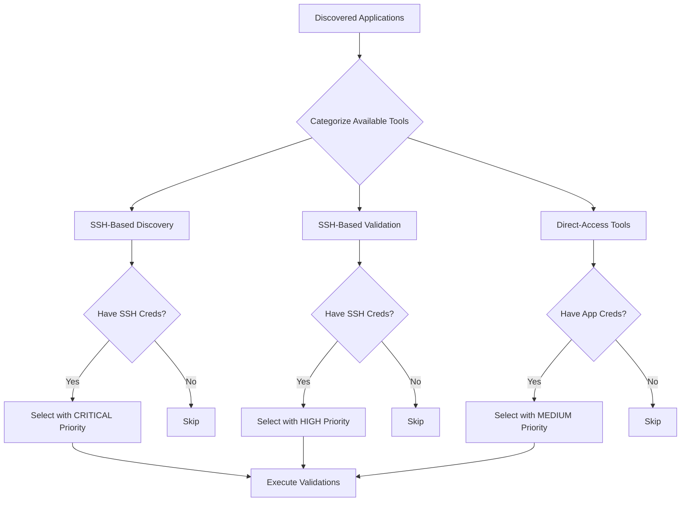

# Tool Categorization Strategy for MCP-Based Validation

## Problem Statement

The current tool selection approach was selecting Oracle validation tools that require **database credentials** (user, password, service) when only **SSH credentials** were available. This caused validation failures.

## Root Cause Analysis

The MCP server provides two types of Oracle tools:

### SSH-Based Tools (✅ Work with SSH credentials only)
- `db_oracle_discover_and_validate` - Discovers Oracle via SSH, optionally validates with DB creds
- VM infrastructure tools - All work via SSH

### Database-Direct Tools (❌ Require DB credentials)
- `db_oracle_connect` - Requires: user, password, dsn/host/service
- `db_oracle_tablespaces` - Requires: user, password, dsn
- `db_oracle_discover_config` - Requires: user, password, host, port, service/sid

The tool selector was matching tools by name only, without considering credential requirements.

## Solution: Tool Categorization System

### Architecture



### Tool Categories

#### 1. SSH-Based Discovery Tools (Priority: CRITICAL)
**Pattern**: `*_discover_and_validate`, `*_discover_*`  
**Requirements**: SSH credentials only  
**Purpose**: Discover and validate applications via SSH without app-specific credentials  
**Examples**:
- `db_oracle_discover_and_validate` - Discovers Oracle SIDs, services, ports via SSH
- `db_mongo_discover_and_validate` - Discovers MongoDB via SSH

**Why CRITICAL**: These tools provide maximum value with minimal credentials. They can:
- Discover application instances
- Validate listener/service status
- Return connection details for future use
- Work without database/application passwords

#### 2. SSH-Based Validation Tools (Priority: HIGH)
**Pattern**: `vm_*`, `ping`, `ssh_*`, `network_*`  
**Requirements**: SSH credentials only  
**Purpose**: Infrastructure-level validation  
**Examples**:
- `vm_validate_core` - Validates VM accessibility and basic health
- `vm_ping` - Network connectivity check
- `vm_ssh_check` - SSH connectivity validation

**Why HIGH**: Essential infrastructure checks that work with SSH credentials.

#### 3. Direct-Access Tools (Priority: MEDIUM - conditional)
**Pattern**: `db_*_connect`, `db_*_tablespaces`, `db_*_config`, `db_*_query`  
**Requirements**: Application-specific credentials (user, password, service/database)  
**Purpose**: Deep application validation and configuration discovery  
**Examples**:
- `db_oracle_connect` - Direct Oracle database connection
- `db_oracle_tablespaces` - Tablespace usage analysis
- `db_mongo_validate_replica_set` - MongoDB replica set validation

**Why MEDIUM**: Valuable but only when credentials are available. Should not block validation if unavailable.

### Selection Algorithm

```python
For each discovered application:
  
  # Step 1: SSH-based discovery (CRITICAL - always try first)
  discovery_tools = find_tools_matching(app_name, pattern="*discover*")
  if discovery_tools and have_ssh_credentials:
      SELECT discovery_tools with CRITICAL priority
  
  # Step 2: Infrastructure validation (HIGH - always include)
  vm_tools = find_tools_matching(pattern="vm_*")
  if vm_tools and have_ssh_credentials:
      SELECT vm_tools with HIGH priority
  
  # Step 3: Direct-access validation (MEDIUM - only if credentials available)
  direct_tools = find_tools_matching(app_name, exclude="*discover*")
  if direct_tools and have_app_credentials(app_name):
      SELECT direct_tools with MEDIUM priority
  else:
      SKIP direct_tools (log: "Skipping - requires app credentials")
```

## Implementation Details

### Tool Access Method Enum

```python
class ToolAccessMethod(Enum):
    """Categorizes tools by their access requirements."""
    SSH_DISCOVERY = "ssh_discovery"      # Discovers via SSH
    SSH_VALIDATION = "ssh_validation"    # Validates via SSH
    DIRECT_ACCESS = "direct_access"      # Requires app credentials
```

### Categorization Logic

```python
def categorize_tool(self, tool_name: str) -> ToolAccessMethod:
    """Categorize tool by analyzing its name and purpose.
    
    Args:
        tool_name: Name of the MCP tool
    
    Returns:
        ToolAccessMethod indicating how the tool accesses resources
    """
    tool_lower = tool_name.lower()
    
    # SSH-based discovery tools
    if "discover" in tool_lower and "validate" in tool_lower:
        return ToolAccessMethod.SSH_DISCOVERY
    
    # SSH-based validation tools (infrastructure)
    if any(pattern in tool_lower for pattern in ["vm_", "ping", "ssh", "network"]):
        return ToolAccessMethod.SSH_VALIDATION
    
    # Direct-access tools (require app credentials)
    return ToolAccessMethod.DIRECT_ACCESS
```

### Parameter Building by Category

```python
def _build_parameters(
    self,
    tool_name: str,
    app_info: Dict[str, Any],
    ssh_creds: Dict[str, str],
    app_creds: Optional[Dict[str, str]] = None
) -> Optional[Dict[str, Any]]:
    """Build tool parameters based on access method.
    
    Returns None if required credentials are unavailable.
    """
    category = self.categorize_tool(tool_name)
    
    # SSH-based tools (discovery and validation)
    if category in [ToolAccessMethod.SSH_DISCOVERY, ToolAccessMethod.SSH_VALIDATION]:
        return {
            "ssh_host": ssh_creds["hostname"],
            "ssh_user": ssh_creds["username"],
            "ssh_password": ssh_creds.get("password"),
            "ssh_key_path": ssh_creds.get("ssh_key_path"),
            "ssh_port": ssh_creds.get("ssh_port", 22)
        }
    
    # Direct-access tools (need app credentials)
    elif category == ToolAccessMethod.DIRECT_ACCESS:
        if not app_creds:
            logger.info(f"Skipping {tool_name} - requires app credentials")
            return None
        
        # Build app-specific parameters
        params = {
            "host": ssh_creds["hostname"],
            "user": app_creds.get("username"),
            "password": app_creds.get("password"),
        }
        
        # Add app-specific fields
        if "oracle" in tool_name.lower():
            params.update({
                "port": app_creds.get("port", 1521),
                "service": app_creds.get("service"),
                "sid": app_creds.get("sid")
            })
        elif "mongo" in tool_name.lower():
            params.update({
                "port": app_creds.get("port", 27017),
                "database": app_creds.get("database", "admin")
            })
        
        return params
```

## Example: Oracle Validation Flow

### Scenario
- **Discovered**: Oracle Database on 9.11.68.243
- **Available Credentials**: SSH only (no database credentials)
- **Available Tools**: 14 Oracle-related tools

### Tool Selection Process

```
Step 1: Categorize Tools
├─ SSH_DISCOVERY: db_oracle_discover_and_validate
├─ SSH_VALIDATION: vm_validate_core, vm_ping, vm_ssh_check
└─ DIRECT_ACCESS: db_oracle_connect, db_oracle_tablespaces, db_oracle_discover_config

Step 2: Select Based on Available Credentials
├─ ✅ db_oracle_discover_and_validate (CRITICAL)
│   └─ Reason: SSH-based discovery, no DB credentials needed
├─ ✅ vm_validate_core (HIGH)
│   └─ Reason: Infrastructure validation via SSH
├─ ✅ vm_ping (HIGH)
│   └─ Reason: Network connectivity check
├─ ❌ db_oracle_connect (SKIPPED)
│   └─ Reason: Requires database credentials (user, password, service)
├─ ❌ db_oracle_tablespaces (SKIPPED)
│   └─ Reason: Requires database credentials
└─ ❌ db_oracle_discover_config (SKIPPED)
    └─ Reason: Requires database credentials

Step 3: Execute Selected Tools
1. db_oracle_discover_and_validate
   → Discovers: SIDs, services, ports, listener status
   → Returns: Candidate DSNs for future use
   → Status: ✅ SUCCESS

2. vm_validate_core
   → Validates: VM accessibility, SSH connectivity
   → Status: ✅ SUCCESS

3. vm_ping
   → Validates: Network connectivity
   → Status: ✅ SUCCESS

Result: Oracle successfully discovered and validated via SSH!
```

## Benefits

### 1. ✅ Works with Partial Credentials
- Validates what's possible with available credentials
- Doesn't fail when app credentials are missing
- Provides maximum value from SSH-only access

### 2. ✅ Follows MCP Best Practices
- Uses dynamic tool discovery
- Categorizes tools by capability
- Selects tools intelligently based on context

### 3. ✅ Clear Prioritization
```
CRITICAL: SSH-based discovery (discover applications)
    ↓
HIGH: Infrastructure validation (verify VM/network)
    ↓
MEDIUM: Direct validation (deep app checks if credentials available)
```

### 4. ✅ Extensible Design
- Easy to add new tool categories
- Simple to support new applications
- Clear pattern for tool classification

### 5. ✅ Graceful Degradation
- Continues validation even without full credentials
- Logs skipped tools with clear reasons
- Provides actionable feedback

## Future Enhancements

### 1. Credential Prompting
When direct-access tools are available but credentials are missing:
```python
if has_direct_tools and not has_app_credentials:
    prompt_user_for_credentials(app_name)
```

### 2. Credential Discovery
Some SSH-based discovery tools return connection details:
```python
discovery_result = execute_tool("db_oracle_discover_and_validate")
if discovery_result.get("candidate_dsns"):
    # Use discovered DSNs for future direct-access tools
    store_discovered_connection_info(discovery_result)
```

### 3. Multi-Stage Validation
```
Stage 1: SSH-based discovery (gather info)
    ↓
Stage 2: Prompt for credentials if needed
    ↓
Stage 3: Direct validation with discovered info + credentials
```

## Migration Guide

### For Existing Code

1. **Update ToolSelector class**:
   - Add `ToolAccessMethod` enum
   - Add `categorize_tool()` method
   - Update `select_tools()` to use categorization
   - Update `_build_parameters()` to handle categories

2. **Update RecoveryValidationAgent**:
   - Pass `app_creds` parameter to `select_tools()`
   - Handle `None` parameters (skipped tools)

3. **Update Documentation**:
   - Document tool categories
   - Provide examples for each category
   - Explain credential requirements

### Testing Strategy

1. **Test with SSH-only credentials**:
   - Verify SSH-based tools are selected
   - Verify direct-access tools are skipped
   - Verify validation succeeds

2. **Test with full credentials**:
   - Verify all applicable tools are selected
   - Verify proper prioritization
   - Verify all validations execute

3. **Test with no credentials**:
   - Verify graceful failure
   - Verify clear error messages

## Conclusion

This tool categorization strategy provides a robust, extensible approach to tool selection that:
- Maximizes validation coverage with available credentials
- Follows MCP best practices for dynamic tool discovery
- Provides clear prioritization and graceful degradation
- Supports future enhancements like credential prompting

The key insight is: **Not all tools require the same credentials. By categorizing tools by their access requirements, we can intelligently select and execute validations based on what's available.**