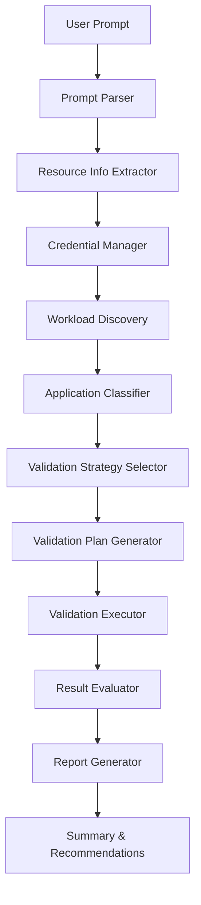

# Infrastructure Validation Workflow with Workload Discovery

## Overview

This document outlines the plan to convert the existing agentic workflow in `python/src` to a comprehensive validation workflow that:

1. **Accepts user prompts** for infrastructure resource validation
2. **Discovers workloads** running on resources using cyberres-mcp tools
3. **Classifies resources** based on enterprise applications detected
4. **Validates resources** using appropriate validation strategies
5. **Generates comprehensive reports** with validation results and recommendations

## Current Architecture Analysis

### Existing Components (Reusable)

#### ✅ Core Components to Keep
- **`models.py`**: Data models for resources, validation results, and reports
- **`planner.py`**: Validation plan generation logic
- **`executor.py`**: Validation execution engine
- **`evaluator.py`**: Result evaluation against acceptance criteria
- **`mcp_client.py`**: MCP server communication layer
- **`credentials.py`**: Credential management
- **`report_generator.py`**: Report generation
- **`conversation.py`**: Interactive conversation handling

#### 🔄 Components to Enhance
- **`discovery.py`**: Add workload discovery capabilities
- **`recovery_validation_agent.py`**: Transform into validation workflow orchestrator

#### ❌ Components to Replace/Remove
- **`agent.py`**: Basic BeeAgent implementation (too simple for our needs)
- **`dataValidatorTools.py`**: Legacy validation tools
- **`mongoDBValidator.py`**: Superseded by MCP tools

## New Workflow Architecture

### High-Level Flow



### Component Details

#### 1. **Validation Workflow Orchestrator** (Enhanced `recovery_validation_agent.py`)

**Purpose**: Main coordinator that orchestrates the entire validation workflow

**Key Responsibilities**:
- Parse user prompts to extract resource information
- Coordinate workload discovery
- Manage application classification
- Select appropriate validation strategies
- Execute validation plans
- Generate comprehensive reports

**New Methods**:
```python
async def run_validation_workflow(self, user_prompt: str) -> ValidationReport:
    """
    Main workflow entry point
    
    Steps:
    1. Parse prompt and extract resource info
    2. Gather credentials (from secrets, env, or prompt)
    3. Discover workloads on resource
    4. Classify applications
    5. Generate validation plan based on classification
    6. Execute validation
    7. Evaluate results
    8. Generate report with recommendations
    """
    pass

async def discover_and_classify(self, resource_info) -> WorkloadClassification:
    """Discover workloads and classify applications"""
    pass

def select_validation_strategy(self, classification) -> ValidationStrategy:
    """Select validation approach based on discovered applications"""
    pass
```

#### 2. **Workload Discovery Integration** (Enhanced `discovery.py`)

**Purpose**: Integrate cyberres-mcp workload discovery tools

**New Capabilities**:
- Scan ports to detect running services
- Analyze processes to identify applications
- Use signature matching for application detection
- Calculate confidence scores for detections
- Aggregate discovery results

**Key Methods**:
```python
async def discover_workloads(self, resource_info) -> WorkloadDiscoveryResult:
    """
    Discover all workloads running on a resource
    
    Uses MCP tools:
    - workload_scan_ports: Detect open ports
    - workload_scan_processes: Identify running processes
    - workload_detect_applications: Match signatures
    - workload_aggregate_results: Combine findings
    """
    pass

async def scan_ports(self, host, ssh_creds) -> List[PortInfo]:
    """Scan for open ports on the resource"""
    pass

async def scan_processes(self, host, ssh_creds) -> List[ProcessInfo]:
    """Scan running processes"""
    pass

async def detect_applications(self, ports, processes) -> List[ApplicationDetection]:
    """Detect applications from ports and processes"""
    pass
```

#### 3. **Application Classifier** (New component)

**Purpose**: Classify resources based on discovered applications

**File**: `python/src/classifier.py`

**Classification Categories**:
- **Database Servers**: Oracle, MongoDB, PostgreSQL, MySQL
- **Web Servers**: Apache, Nginx, IIS
- **Application Servers**: Tomcat, JBoss, WebLogic
- **Message Queues**: RabbitMQ, Kafka, ActiveMQ
- **Cache Servers**: Redis, Memcached
- **Custom Applications**: Based on signature matching

**Key Methods**:
```python
class ApplicationClassifier:
    def classify(self, discovery_result: WorkloadDiscoveryResult) -> ResourceClassification:
        """
        Classify resource based on discovered applications
        
        Returns:
        - Primary application type
        - Secondary applications
        - Confidence scores
        - Recommended validation strategies
        """
        pass
    
    def get_validation_requirements(self, classification) -> ValidationRequirements:
        """Get validation requirements for classified applications"""
        pass
```

#### 4. **Validation Strategy Selector** (New component)

**Purpose**: Select appropriate validation strategies based on classification

**File**: `python/src/validation_strategy.py`

**Strategies**:
- **Database-Centric**: Focus on DB connectivity, tablespaces, replication
- **Web-Centric**: Focus on HTTP endpoints, SSL certificates, response times
- **Application-Centric**: Focus on application-specific health checks
- **Hybrid**: Combine multiple strategies for complex environments

**Key Methods**:
```python
class ValidationStrategySelector:
    def select_strategy(self, classification: ResourceClassification) -> ValidationStrategy:
        """Select validation strategy based on classification"""
        pass
    
    def generate_validation_plan(self, strategy, resource_info) -> ValidationPlan:
        """Generate validation plan for selected strategy"""
        pass
```

#### 5. **Enhanced MCP Client** (Updated `mcp_client.py`)

**New Methods for Workload Discovery**:
```python
# Workload Discovery Tools
async def workload_scan_ports(self, host, ssh_user, ssh_password=None, ssh_key_path=None):
    """Scan ports on remote host"""
    pass

async def workload_scan_processes(self, host, ssh_user, ssh_password=None, ssh_key_path=None):
    """Scan running processes"""
    pass

async def workload_detect_applications(self, ports, processes):
    """Detect applications from scan results"""
    pass

async def workload_aggregate_results(self, port_results, process_results, app_detections):
    """Aggregate all discovery results"""
    pass
```

#### 6. **Enhanced Models** (Updated `models.py`)

**New Data Models**:
```python
@dataclass
class PortInfo:
    port: int
    protocol: str
    service: Optional[str]
    state: str

@dataclass
class ProcessInfo:
    pid: int
    name: str
    cmdline: str
    user: str

@dataclass
class ApplicationDetection:
    name: str
    version: Optional[str]
    confidence: float
    detection_method: str
    evidence: Dict[str, Any]

@dataclass
class WorkloadDiscoveryResult:
    host: str
    ports: List[PortInfo]
    processes: List[ProcessInfo]
    applications: List[ApplicationDetection]
    discovery_time: datetime

@dataclass
class ResourceClassification:
    primary_type: str
    secondary_types: List[str]
    applications: List[ApplicationDetection]
    confidence: float
    recommended_validations: List[str]

@dataclass
class ValidationStrategy:
    name: str
    description: str
    validation_steps: List[str]
    acceptance_criteria: Dict[str, Any]
```

## Implementation Phases

### Phase 1: Foundation (Week 1)
- [x] Analyze existing architecture
- [ ] Design new workflow architecture
- [ ] Update models with workload discovery structures
- [ ] Enhance MCP client with workload discovery methods
- [ ] Create application classifier component

### Phase 2: Core Workflow (Week 2)
- [ ] Implement workload discovery integration
- [ ] Create validation strategy selector
- [ ] Enhance validation planner with classification support
- [ ] Update orchestrator with new workflow
- [ ] Implement credential management enhancements

### Phase 3: Validation & Reporting (Week 3)
- [ ] Enhance evaluator with application-specific criteria
- [ ] Update report generator with discovery insights
- [ ] Add recommendation engine based on classifications
- [ ] Implement comprehensive logging and error handling

### Phase 4: Testing & Documentation (Week 4)
- [ ] Create unit tests for all components
- [ ] Create integration tests for workflow
- [ ] Write user documentation
- [ ] Create example prompts and use cases
- [ ] Performance testing and optimization

## User Experience Flow

### Example User Prompt
```
"I want to validate the infrastructure at 192.168.1.100. 
The SSH user is admin with password from secrets file."
```

### Workflow Execution

1. **Prompt Parsing**
   - Extract: host=192.168.1.100, ssh_user=admin
   - Credential source: secrets file

2. **Credential Resolution**
   - Load from secrets.json
   - Merge with user-provided info

3. **Workload Discovery**
   ```
   Discovering workloads on 192.168.1.100...
   ✓ Found 15 open ports
   ✓ Identified 42 running processes
   ✓ Detected 3 applications:
     - Oracle Database 19c (confidence: 95%)
     - Apache HTTP Server 2.4 (confidence: 88%)
     - Custom Java Application (confidence: 72%)
   ```

4. **Classification**
   ```
   Resource Classification:
   - Primary Type: Database Server (Oracle)
   - Secondary Types: Web Server (Apache)
   - Recommended Validations: DB connectivity, tablespace usage, 
     HTTP endpoint checks, SSL certificate validation
   ```

5. **Validation Plan Generation**
   ```
   Generated validation plan with 8 steps:
   1. Network connectivity (SSH, Oracle port 1521, HTTP port 80/443)
   2. Oracle database connection
   3. Tablespace usage check
   4. Oracle instance health
   5. Apache HTTP server status
   6. SSL certificate validation
   7. Application endpoint checks
   8. System resource utilization
   ```

6. **Execution & Results**
   ```
   Executing validation plan...
   ✓ Step 1/8: Network connectivity - PASS
   ✓ Step 2/8: Oracle connection - PASS
   ⚠ Step 3/8: Tablespace usage - WARNING (USERS: 82% used)
   ✓ Step 4/8: Oracle health - PASS
   ...
   
   Validation Score: 87/100
   Overall Status: WARNING
   ```

7. **Report Generation**
   ```
   Validation Report Summary:
   - Resource: 192.168.1.100 (Database Server)
   - Applications: Oracle 19c, Apache 2.4
   - Total Checks: 8
   - Passed: 7
   - Warnings: 1
   - Failed: 0
   
   Recommendations:
   1. Increase USERS tablespace size (currently 82% used)
   2. Consider enabling Oracle automatic memory management
   3. Update Apache to latest security patch
   ```

## Credential Management Strategy

### Supported Sources (Priority Order)

1. **User-provided in prompt**: Highest priority
2. **Secrets file** (`secrets.json`): Default for sensitive data
3. **Environment variables**: Fallback option
4. **API/Secrets Manager**: Future enhancement

### Secrets File Structure
```json
{
  "resources": {
    "192.168.1.100": {
      "ssh_user": "admin",
      "ssh_password": "encrypted_password",
      "oracle_user": "system",
      "oracle_password": "encrypted_password"
    }
  },
  "defaults": {
    "ssh_user": "root",
    "oracle_port": 1521,
    "mongodb_port": 27017
  }
}
```

## Validation Strategies by Application Type

### Database Servers

**Oracle**:
- Connection test
- Instance health
- Tablespace usage
- Archive log status
- Listener status

**MongoDB**:
- Connection test
- Replica set status
- Collection validation
- Oplog status

### Web Servers

**Apache/Nginx**:
- HTTP/HTTPS endpoint checks
- SSL certificate validation
- Response time monitoring
- Configuration validation

### Application Servers

**Tomcat/JBoss**:
- Management endpoint checks
- Application deployment status
- Thread pool utilization
- Memory usage

## Error Handling & Recovery

### Graceful Degradation
- If workload discovery fails, fall back to user-specified resource type
- If specific validation fails, continue with remaining checks
- Provide partial results with clear error messages

### Retry Logic
- Network operations: 3 retries with exponential backoff
- SSH connections: 2 retries
- Database connections: 2 retries

## Performance Considerations

### Optimization Strategies
- Parallel execution of independent validation steps
- Caching of discovery results for repeated validations
- Connection pooling for database checks
- Timeout management for long-running operations

### Expected Performance
- Workload discovery: 10-30 seconds
- Validation execution: 30-60 seconds
- Total workflow: 1-2 minutes per resource

## Security Considerations

### Credential Protection
- Never log passwords or sensitive data
- Use encrypted storage for secrets file
- Support SSH key-based authentication
- Implement credential rotation support

### Network Security
- Support SSH tunneling for database connections
- Validate SSL certificates
- Support firewall-friendly protocols

## Future Enhancements

### Phase 2 Features
1. **Multi-resource validation**: Validate multiple resources in parallel
2. **Scheduled validations**: Periodic validation with alerting
3. **Trend analysis**: Track validation scores over time
4. **Custom validation rules**: User-defined validation criteria
5. **Integration with monitoring tools**: Export metrics to Prometheus/Grafana
6. **API/Secrets Manager integration**: AWS Secrets Manager, HashiCorp Vault

### Advanced Features
1. **Machine learning**: Improve application detection accuracy
2. **Anomaly detection**: Identify unusual patterns
3. **Predictive analysis**: Forecast potential issues
4. **Automated remediation**: Suggest and apply fixes

## Success Criteria

### Functional Requirements
- ✅ Accept natural language prompts for validation
- ✅ Discover workloads automatically
- ✅ Classify resources accurately (>85% confidence)
- ✅ Execute comprehensive validations
- ✅ Generate actionable reports

### Non-Functional Requirements
- **Performance**: Complete validation in <2 minutes
- **Reliability**: 99% success rate for valid inputs
- **Usability**: Clear error messages and progress indicators
- **Maintainability**: Modular architecture with clear separation of concerns
- **Extensibility**: Easy to add new application types and validation strategies

## Conclusion

This plan transforms the existing recovery validation agent into a comprehensive infrastructure validation workflow that:

1. **Intelligently discovers** what's running on resources
2. **Automatically classifies** resources based on applications
3. **Selects appropriate** validation strategies
4. **Executes comprehensive** validation checks
5. **Generates actionable** reports and recommendations

The modular architecture ensures extensibility for future enhancements while maintaining the robust foundation of the existing codebase.