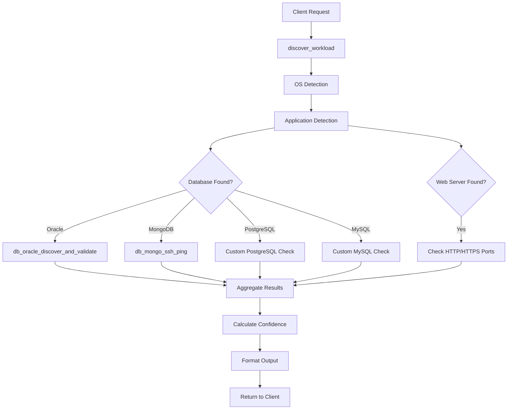

 into single SSH session"""
        # Combine commands with && to execute in one SSH session
        return " && ".join(commands)
    
    def optimize_command_execution(self, commands: List[str]) -> List[str]:
        """
        Optimize command execution order and grouping.
        
        Strategy:
        - Group related commands together
        - Execute fast commands first
        - Cache results where possible
        - Skip redundant checks
        """
        # Prioritize fast commands
        fast_commands = [cmd for cmd in commands if self._is_fast_command(cmd)]
        slow_commands = [cmd for cmd in commands if not self._is_fast_command(cmd)]
        
        return fast_commands + slow_commands
    
    def _is_fast_command(self, command: str) -> bool:
        """Determine if command is fast (< 1 second typically)"""
        fast_patterns = [
            "cat /etc/os-release",
            "hostname",
            "uname",
            "systemctl list-units",
            "ps -eo"
        ]
        return any(pattern in command for pattern in fast_patterns)
```

### 8.2 Caching Strategy

```python
class DiscoveryCache:
    """Cache discovery results to avoid redundant scans"""
    
    def __init__(self, ttl_seconds: int = 300):
        self.cache = {}
        self.ttl = ttl_seconds
    
    def get(self, host: str) -> Optional[WorkloadDiscoveryResult]:
        """Get cached result if still valid"""
        if host in self.cache:
            cached_time, result = self.cache[host]
            if time.time() - cached_time < self.ttl:
                return result
        return None
    
    def set(self, host: str, result: WorkloadDiscoveryResult):
        """Cache discovery result"""
        self.cache[host] = (time.time(), result)
    
    def invalidate(self, host: str):
        """Invalidate cache for specific host"""
        if host in self.cache:
            del self.cache[host]
```

---

## 9. Security Considerations

### 9.1 Credential Management

```python
class SecureCredentialHandler:
    """Handle credentials securely"""
    
    def __init__(self):
        self.secrets_file = os.getenv("SECRETS_FILE", "secrets.json")
    
    def get_credentials(self, host: str) -> Optional[Dict[str, str]]:
        """Retrieve credentials from secure storage"""
        # Load from secrets file (already implemented in server.py)
        # Credentials are never logged (handled by SensitiveDataFilter)
        pass
    
    def validate_ssh_key_permissions(self, key_path: str) -> bool:
        """Ensure SSH key has correct permissions (600)"""
        import stat
        st = os.stat(key_path)
        return bool(st.st_mode & stat.S_IRUSR) and not bool(st.st_mode & (stat.S_IRWXG | stat.S_IRWXO))
```

### 9.2 Security Best Practices

1. **Credential Storage**
   - Never log passwords or keys
   - Use secrets.json with restricted permissions (600)
   - Support SSH key-based authentication
   - Rotate credentials regularly

2. **Command Execution**
   - Sanitize all inputs to prevent injection
   - Use parameterized commands where possible
   - Limit command execution to read-only operations
   - Implement command whitelisting

3. **Network Security**
   - Use SSH for all remote operations
   - Support SSH key authentication
   - Implement connection timeouts
   - Log all connection attempts

4. **Data Protection**
   - Redact sensitive data in logs (already implemented)
   - Encrypt data in transit (SSH)
   - Limit data retention
   - Implement access controls

---

## 10. Implementation Phases

### Phase 1: Foundation (Week 1-2)

**Objectives:**
- Set up plugin structure
- Implement data models
- Create OS detection for Linux

**Deliverables:**
- [ ] Data models in [`models.py`](../src/cyberres_mcp/models.py)
- [ ] Plugin structure in [`plugins/workload_discovery/`](../src/cyberres_mcp/plugins/workload_discovery/)
- [ ] OS detector for Linux (RHEL, Ubuntu, Debian)
- [ ] Basic SSH execution framework
- [ ] Unit tests for OS detection

**Success Criteria:**
- OS detection works for major Linux distributions
- 90%+ accuracy on test systems
- < 5 second execution time

### Phase 2: Application Detection (Week 3-4)

**Objectives:**
- Implement process-based detection
- Add port-based detection
- Create signature database

**Deliverables:**
- [ ] Process scanner implementation
- [ ] Port scanner integration
- [ ] Signature database with 20+ applications
- [ ] Confidence scoring system
- [ ] Integration tests

**Success Criteria:**
- Detect top 10 enterprise applications (Oracle, PostgreSQL, MySQL, MongoDB, Apache, Nginx, Tomcat, Redis, Docker, Kubernetes)
- 80%+ detection accuracy
- < 30 second execution time

### Phase 3: Advanced Detection (Week 5-6)

**Objectives:**
- Add package manager detection
- Implement service enumeration
- Add configuration file detection
- Container detection

**Deliverables:**
- [ ] Package manager queries (rpm, dpkg, yum, apt)
- [ ] Service enumeration (systemd, init.d)
- [ ] Config file detection
- [ ] Container runtime detection (Docker, Kubernetes)
- [ ] Result aggregation logic

**Success Criteria:**
- Multi-method detection for all applications
- Confidence scoring working correctly
- Handle partial discovery gracefully

### Phase 4: Windows Support (Week 7-8)

**Objectives:**
- Add Windows OS detection
- Implement Windows application detection
- Add registry-based detection

**Deliverables:**
- [ ] Windows OS detector
- [ ] WMI/PowerShell integration
- [ ] Windows service detection
- [ ] Registry inspection
- [ ] Windows-specific signatures

**Success Criteria:**
- Windows Server detection working
- Detect IIS, MSSQL, and common Windows apps
- Unified output format for Linux and Windows

### Phase 5: Optimization & Polish (Week 9-10)

**Objectives:**
- Performance optimization
- Error handling improvements
- Documentation
- Testing

**Deliverables:**
- [ ] Performance optimizations (parallel execution, caching)
- [ ] Comprehensive error handling
- [ ] Complete documentation
- [ ] Integration with existing plugins
- [ ] Demo scenarios and examples
- [ ] Load testing results

**Success Criteria:**
- < 60 second full discovery on typical server
- Graceful handling of all error scenarios
- Complete API documentation
- 90%+ test coverage

### Phase 6: Extensibility & LLM Integration (Week 11-12)

**Objectives:**
- Custom signature support
- LLM integration patterns
- Advanced features

**Deliverables:**
- [ ] Custom signature API
- [ ] LLM integration examples (client-side)
- [ ] Prompt templates for common scenarios
- [ ] Advanced filtering and querying
- [ ] Export formats (JSON, CSV, YAML)

**Success Criteria:**
- Users can add custom signatures without code changes
- LLM integration examples working
- Production-ready feature set

---

## 11. API Specifications

### 11.1 Tool: discover_workload

**Purpose:** Comprehensive workload discovery

**Parameters:**
```typescript
{
  host: string;                    // Required: Target hostname/IP
  ssh_user?: string;               // SSH username
  ssh_password?: string;           // SSH password
  ssh_key_path?: string;           // SSH private key path
  ssh_port?: number;               // Default: 22
  detect_os?: boolean;             // Default: true
  detect_applications?: boolean;   // Default: true
  detect_containers?: boolean;     // Default: true
  scan_ports?: boolean;            // Default: false
  port_range?: string;             // e.g., "1-1024" or "80,443,3306"
  timeout_seconds?: number;        // Default: 300
  min_confidence?: string;         // "high"|"medium"|"low"|"uncertain"
}
```

**Response:**
```typescript
{
  ok: boolean;
  target_host: string;
  target_ip?: string;
  discovery_timestamp: string;
  discovery_duration_seconds: number;
  
  os_info: {
    os_type: string;
    distribution?: string;
    version?: string;
    kernel_version?: string;
    architecture?: string;
    hostname?: string;
    uptime_seconds?: number;
    confidence: string;
    detection_methods: string[];
  };
  
  applications: Array<{
    name: string;
    category: string;
    version?: string;
    vendor?: string;
    process_name?: string;
    pid?: number;
    command_line?: string;
    user?: string;
    install_path?: string;
    config_paths: string[];
    network_bindings: Array<{
      port: number;
      protocol: string;
      address: string;
    }>;
    confidence: string;
    detection_methods: string[];
    detection_timestamp: string;
    metadata: object;
    tags: string[];
  }>;
  
  container_info?: {
    runtime: string;
    version?: string;
    orchestrator?: string;
    orchestrator_version?: string;
    containers_running?: number;
    images_count?: number;
  };
  
  total_applications: number;
  applications_by_category: object;
  high_confidence_count: number;
  medium_confidence_count: number;
  low_confidence_count: number;
  
  errors: Array<{message: string; code: string}>;
  warnings: Array<{message: string; severity: string}>;
  raw_detection_data: object;
}
```

### 11.2 Tool: discover_os_only

**Purpose:** Fast OS detection only

**Parameters:**
```typescript
{
  host: string;
  ssh_user?: string;
  ssh_password?: string;
  ssh_key_path?: string;
  ssh_port?: number;
}
```

**Response:**
```typescript
{
  ok: boolean;
  os_type: string;
  distribution?: string;
  version?: string;
  kernel_version?: string;
  architecture?: string;
  hostname?: string;
  uptime_seconds?: number;
  confidence: string;
  detection_methods: string[];
  raw_data: object;
}
```

### 11.3 Tool: list_application_signatures

**Purpose:** List available application signatures

**Parameters:** None

**Response:**
```typescript
{
  ok: boolean;
  total_signatures: number;
  by_category: {
    database: number;
    web_server: number;
    app_server: number;
    // ... other categories
  };
  signatures: Array<{
    name: string;
    category: string;
    vendor?: string;
    process_patterns: string[];
    port_numbers: number[];
    config_paths: string[];
    package_names: string[];
    service_names: string[];
    description?: string;
  }>;
}
```

### 11.4 Tool: add_custom_signature

**Purpose:** Add custom application signature

**Parameters:**
```typescript
{
  name: string;                    // Required
  category: string;                // Required
  process_patterns?: string[];
  port_numbers?: number[];
  config_paths?: string[];
  package_names?: string[];
  service_names?: string[];
  description?: string;
}
```

**Response:**
```typescript
{
  ok: boolean;
  message: string;
  name: string;
  category: string;
}
```

---

## 12. Usage Examples

### 12.1 Basic Discovery

```json
{
  "tool": "discover_workload",
  "args": {
    "host": "10.0.1.5",
    "ssh_user": "admin",
    "ssh_password": "secret123",
    "detect_applications": true,
    "min_confidence": "medium"
  }
}
```

### 12.2 Fast OS Detection

```json
{
  "tool": "discover_os_only",
  "args": {
    "host": "10.0.1.5",
    "ssh_user": "admin",
    "ssh_key_path": "/home/user/.ssh/id_rsa"
  }
}
```

### 12.3 Comprehensive Discovery with Port Scan

```json
{
  "tool": "discover_workload",
  "args": {
    "host": "db-server-01",
    "ssh_user": "admin",
    "ssh_password": "secret123",
    "detect_os": true,
    "detect_applications": true,
    "detect_containers": true,
    "scan_ports": true,
    "port_range": "1-10000",
    "timeout_seconds": 600,
    "min_confidence": "low"
  }
}
```

### 12.4 Add Custom Application

```json
{
  "tool": "add_custom_signature",
  "args": {
    "name": "MyEnterpriseApp",
    "category": "custom",
    "process_patterns": ["myapp-server.*", "myapp-worker.*"],
    "port_numbers": [9000, 9001],
    "config_paths": ["/etc/myapp/config.yaml", "/opt/myapp/conf/app.conf"],
    "service_names": ["myapp-server", "myapp-worker"],
    "description": "Custom enterprise application for business logic"
  }
}
```

---

## 13. Integration with Existing Plugins

### 13.1 Leveraging Existing Infrastructure

The workload discovery plugin will integrate with existing plugins:

```python
# Use existing SSH execution from vms_validator
from .vms_validator import _ssh_exec

# Use existing SSH command runner from mongo_db
from .mongo_db import run_ssh_command

# Use existing network tools
from .net import tcp_portcheck

# Use existing Oracle discovery
from .oracle_db import db_oracle_discover_and_validate

# Use existing MongoDB discovery
from .mongo_db import db_mongo_ssh_ping
```

### 13.2 Enhanced Discovery Workflow



---

## 14. Testing Strategy

### 14.1 Unit Tests

```python
# tests/test_os_detector.py
def test_linux_rhel_detection():
    """Test RHEL detection from /etc/os-release"""
    mock_output = """
    NAME="Red Hat Enterprise Linux"
    VERSION="8.5 (Ootpa)"
    ID="rhel"
    VERSION_ID="8.5"
    """
    detector = OSDetector()
    result = detector.parse_os_release(mock_output)
    assert result.os_type == OSType.LINUX
    assert result.distribution == OSDistribution.RHEL
    assert result.version == "8.5"

def test_confidence_scoring():
    """Test confidence calculation"""
    scorer = ConfidenceScorer()
    score, level = scorer.calculate_confidence(
        detection_methods=[DetectionMethod.PROCESS_SCAN, DetectionMethod.PORT_SCAN],
        signature_matches=2,
        version_detected=True,
        config_found=True,
        process_found=True,
        port_matches=1
    )
    assert score >= 0.9
    assert level == ConfidenceLevel.HIGH
```

### 14.2 Integration Tests

```python
# tests/integration/test_discovery.py
@pytest.mark.integration
def test_full_discovery_linux():
    """Test full discovery on Linux test VM"""
    result = discover_workload(
        host="test-vm-linux",
        ssh_user="testuser",
        ssh_password="testpass"
    )
    assert result["ok"] == True
    assert result["os_info"]["os_type"] == "linux"
    assert len(result["applications"]) > 0
```

### 14.3 Test Environments

| Environment | OS | Applications | Purpose |
|-------------|----|--------------| --------|
| test-rhel8 | RHEL 8.5 | Oracle, Apache, Docker | RHEL testing |
| test-ubuntu | Ubuntu 22.04 | PostgreSQL, Nginx, Redis | Ubuntu testing |
| test-windows | Windows Server 2019 | IIS, MSSQL | Windows testing |
| test-mixed | Ubuntu 20.04 | Multiple databases, containers | Complex scenario |

---

## 15. Monitoring and Observability

### 15.1 Metrics to Track

```python
# Metrics for monitoring discovery performance
DISCOVERY_METRICS = {
    "discovery_duration_seconds": "Time taken for full discovery",
    "applications_discovered": "Number of applications found",
    "high_confidence_discoveries": "Count of high-confidence findings",
    "detection_errors": "Number of detection errors",
    "ssh_connection_failures": "SSH connection failure count",
    "cache_hit_rate": "Percentage of cache hits",
    "average_confidence_score": "Average confidence across all discoveries"
}
```

### 15.2 Logging Strategy

```python
# Structured logging for discovery operations
logger.info(
    "Discovery completed",
    extra={
        "host": host,
        "duration_seconds": duration,
        "applications_found": len(applications),
        "high_confidence_count": high_conf_count,
        "errors": len(errors),
        "detection_methods_used": methods_used
    }
)
```

---

## 16. Documentation Deliverables

### 16.1 User Documentation

- [ ] **User Guide**: Step-by-step usage instructions
- [ ] **API Reference**: Complete tool documentation
- [ ] **Examples**: Common use cases and patterns
- [ ] **Troubleshooting**: Common issues and solutions
- [ ] **Best Practices**: Recommendations for production use

### 16.2 Developer Documentation

- [ ] **Architecture Guide**: System design and components
- [ ] **Plugin Development**: How to extend the plugin
- [ ] **Signature Creation**: Adding custom application signatures
- [ ] **Testing Guide**: Running and writing tests
- [ ] **Contributing**: Guidelines for contributors

### 16.3 Operational Documentation

- [ ] **Deployment Guide**: Installation and configuration
- [ ] **Security Guide**: Security best practices
- [ ] **Performance Tuning**: Optimization recommendations
- [ ] **Monitoring Guide**: Metrics and alerting
- [ ] **Runbook**: Common operational procedures

---

## 17. Success Metrics

### 17.1 Technical Metrics

| Metric | Target | Measurement |
|--------|--------|-------------|
| Detection Accuracy | > 90% | % of correctly identified applications |
| Discovery Speed | < 60s | Average time for full discovery |
| False Positive Rate | < 5% | % of incorrect identifications |
| Coverage | > 50 apps | Number of supported applications |
| Confidence Accuracy | > 85% | Correlation between confidence and accuracy |

### 17.2 Operational Metrics

| Metric | Target | Measurement |
|--------|--------|-------------|
| Server Impact | < 5% CPU | CPU usage during discovery |
| Error Rate | < 2% | % of failed discoveries |
| Cache Hit Rate | > 70% | % of cached results used |
| Timeout Rate | < 1% | % of discoveries that timeout |

### 17.3 User Satisfaction Metrics

| Metric | Target | Measurement |
|--------|--------|-------------|
| Ease of Use | > 4.5/5 | User survey rating |
| Documentation Quality | > 4.0/5 | User survey rating |
| Feature Completeness | > 4.0/5 | User survey rating |

---

## 18. Risk Assessment and Mitigation

### 18.1 Technical Risks

| Risk | Impact | Probability | Mitigation |
|------|--------|-------------|------------|
| SSH authentication failures | High | Medium | Support multiple auth methods, clear error messages |
| Performance issues on large environments | High | Medium | Implement caching, parallel execution, timeouts |
| False positives in detection | Medium | Medium | Multi-method validation, confidence scoring |
| Windows support complexity | Medium | High | Phase approach, focus on Linux first |
| Signature database maintenance | Medium | Low | Community contributions, automated updates |

### 18.2 Security Risks

| Risk | Impact | Probability | Mitigation |
|------|--------|-------------|------------|
| Credential exposure | Critical | Low | Secure storage, log redaction, encryption |
| Command injection | High | Low | Input sanitization, parameterized commands |
| Unauthorized access | High | Low | Authentication required, audit logging |
| Data leakage | Medium | Low | Minimal data collection, secure transmission |

### 18.3 Operational Risks

| Risk | Impact | Probability | Mitigation |
|------|--------|-------------|------------|
| Server overload from discovery | Medium | Medium | Rate limiting, resource monitoring |
| Network connectivity issues | Medium | High | Retry logic, timeout handling |
| Incomplete documentation | Medium | Medium | Comprehensive docs, examples, tutorials |
| User adoption challenges | Low | Medium | Training, demos, support channels |

---

## 19. Future Enhancements

### 19.1 Short-term (3-6 months)

- [ ] PostgreSQL deep discovery (similar to Oracle)
- [ ] MySQL/MariaDB deep discovery
- [ ] MSSQL Server discovery
- [ ] Enhanced container insights (pod details, images)
- [ ] Network topology mapping
- [ ] Dependency detection (app-to-app relationships)

### 19.2 Medium-term (6-12 months)

- [ ] Cloud platform detection (AWS, Azure, GCP)
- [ ] Kubernetes cluster discovery
- [ ] Application performance metrics
- [ ] Configuration drift detection
- [ ] Compliance checking
- [ ] Automated remediation suggestions

### 19.3 Long-term (12+ months)

- [ ] Machine learning for pattern recognition
- [ ] Predictive analytics for capacity planning
- [ ] Integration with CMDB systems
- [ ] Real-time monitoring integration
- [ ] Multi-datacenter discovery orchestration
- [ ] Advanced visualization and reporting

---

## 20. Conclusion

This comprehensive technical plan provides a roadmap for implementing a production-ready workload discovery tool within the cyberres-mcp server. The design balances:

- **Accuracy**: Multi-method detection with confidence scoring
- **Performance**: Optimized execution with minimal server impact
- **Intelligence**: Rich output for LLM-based analysis (client-side)
- **Extensibility**: Plugin architecture for custom signatures
- **Security**: Secure credential handling and audit logging
- **Usability**: Clear API, comprehensive documentation

### Next Steps

1. **Review and Approval**: Stakeholder review of this plan
2. **Resource Allocation**: Assign development team
3. **Environment Setup**: Prepare test infrastructure
4. **Phase 1 Kickoff**: Begin foundation implementation
5. **Iterative Development**: Follow phased approach with regular reviews

### Questions for Stakeholders

1. Are there specific applications or platforms that should be prioritized?
2. What are the performance requirements for production environments?
3. Are there compliance or security requirements we should address?
4. What is the expected timeline for production deployment?
5. What level of Windows support is required initially?

---

**Document Version:** 1.0  
**Last Updated:** 2026-02-11  
**Status:** Ready for Review  
**Next Review:** After Phase 1 completion